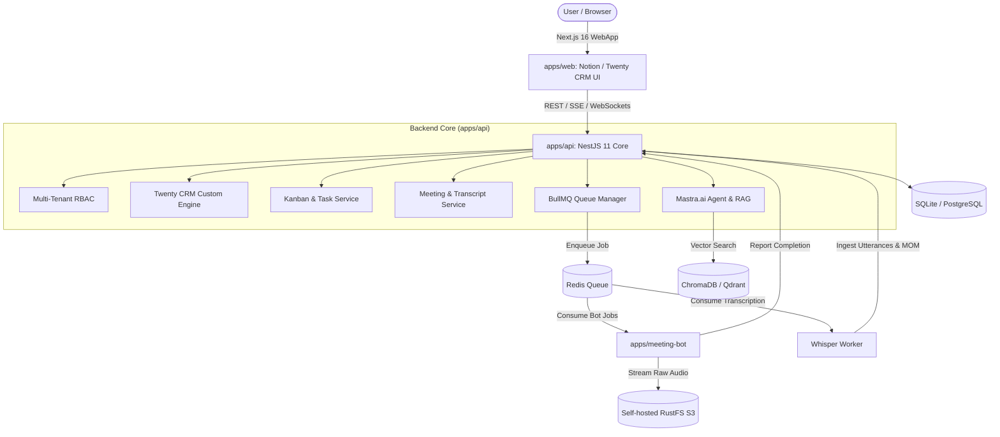

<div align="center">

# KARA AI

**The Autonomous AI Chief of Staff & Intelligent Workspace Operating System**

[](https://nextjs.org/)
[](https://nestjs.com/)
[](https://react.dev/)
[](https://mastra.ai/)
[](https://bullmq.io/)
[](https://turbo.build/)
[](https://tailwindcss.com/)

<p align="center">
  Kara joins your team meetings, transcribes audio, synthesizes action items into
  Notion-style Kanban boards, provides a <b>zero-hallucination</b> conversational
  RAG layer over your company history, and powers a fully customizable
  Twenty CRM data engine.
</p>

[Documentation](docs/01_ARCHITECTURE_AND_SYSTEM_OVERVIEW.md) &middot; [Ultralight Setup](docs/02_ULTRALIGHT_LOCAL_STACK_SETUP.md) &middot; [Roadmap](docs/07_PHASED_IMPLEMENTATION_ROADMAP.md)

</div>

---

## Highlights

- **Autonomous Meeting Bot** &mdash; Stateless Chromium worker joins Google Meet, Zoom, and MS Teams, streaming audio directly to S3 without database locking.
- **Batch Diarization & MOM Synthesis** &mdash; Fast, cost-efficient speech-to-text with speaker identification, automatic executive summaries, and action item extraction.
- **Zero-Hallucination Mastra RAG** &mdash; Grounded AI search with hard temporal guardrails. Kara *never* confuses upcoming calendar events with past discussions.
- **Notion-Style Kanban & Task OS** &mdash; Automatically promotes meeting action items into interactive Kanban cards with assignees, audio replay timestamps, and drag-and-drop workflows.
- **Twenty CRM Custom Engine** &mdash; Create custom entities (Deals, Partners, Investors) and fields (Text, Select, Relation, Date) with an inline-editable table view.
- **Ultralight Local Development** &mdash; Designed for minimal laptop strain. Runs on local SQLite, ChromaDB, and your self-hosted RustFS S3 on Oracle Cloud.

---

## System Architecture



---

## Monorepo Structure

```
kara/
|-- apps/
|   |-- web/                     # Next.js 16 App Router (React 19, Tailwind v4, TanStack)
|   |-- api/                     # NestJS 11 backend + @mastra/nestjs + BullMQ
|   |-- meeting-bot/             # Stateless containerized Chromium bot
|-- packages/
|   |-- db/                      # Database Layer (Prisma / Drizzle ORM)
|   |-- shared-types/            # Shared Zod schemas, TypeScript DTOs, and enums
|   |-- ui/                      # Shared design tokens and Radix components
|-- docs/                        # Numbered engineering documentation
|-- .env.example                 # Centralized single-environment configuration
|-- docker-compose.yml           # Optional local container services
|-- pnpm-workspace.yaml          # Workspace configuration
|-- turbo.json                   # Turborepo task pipeline
```

---

## Tech Stack

| Layer | Technology | Version |
| :--- | :--- | :--- |
| **Frontend** | Next.js (App Router, Turbopack) | 16.3+ |
| **UI Framework** | React | 19.2+ |
| **Styling** | Tailwind CSS | v4.3+ |
| **State (Client)** | Zustand | 5.0+ |
| **State (Server)** | TanStack Query | v5.100+ |
| **Tables & Data Grids** | TanStack Table | v9.2+ |
| **Backend** | NestJS | 11.0+ |
| **Queue Engine** | BullMQ + Redis | 6.0+ |
| **AI Agent Framework** | Mastra.ai (`@mastra/nestjs`) | Latest |
| **Database** | SQLite (dev) / PostgreSQL (prod) | 16+ |
| **Vector Store** | ChromaDB (dev) / Qdrant (prod) | Latest |
| **Object Storage** | S3 Protocol (RustFS / MinIO / R2) | S3 v4 |
| **Language** | TypeScript | 5.9+ |
| **Monorepo** | Turborepo + pnpm workspaces | 2.11+ |

---

## Quickstart

### Prerequisites

- **Node.js** v22.13.0 or later
- **pnpm** v10+ or v12+
- **Redis** local or cloud connection string

### 1. Clone and Install

```bash
git clone https://github.com/your-org/kara.git
cd kara
pnpm install
```

### 2. Configure Environment

```bash
cp .env.example .env
```

Update `.env` with your LLM API keys (`OPENAI_API_KEY`, `GROQ_API_KEY`) and your self-hosted RustFS S3 endpoint.

### 3. Build and Run

```bash
# Build all packages via Turborepo
pnpm run build

# Start both frontend (port 3000) and backend (port 4000) concurrently
pnpm run dev
```

Visit **http://localhost:3000** to access the Kara workspace dashboard.

---

## Documentation

All architectural blueprints and design guides are in the `docs/` directory:

| # | Document | Description |
| :--- | :--- | :--- |
| 01 | [Architecture and System Overview](docs/01_ARCHITECTURE_AND_SYSTEM_OVERVIEW.md) | System boundaries, monolith design, and post-mortem of previous prototype. |
| 02 | [Ultralight Local Stack Setup](docs/02_ULTRALIGHT_LOCAL_STACK_SETUP.md) | Hardware optimization with SQLite, ChromaDB, and Oracle VPS RustFS. |
| 03 | [Meeting Bot & Transcription Pipeline](docs/03_MEETING_BOT_AND_TRANSCRIPTION_PIPELINE.md) | Non-locking bot orchestration and batch Whisper diarization. |
| 04 | [Non-Hallucinatory Mastra RAG](docs/04_NON_HALLUCINATORY_MASTRA_RAG.md) | Temporal vector bounding and tool isolation to prevent hallucinations. |
| 05 | [Twenty CRM Custom Data Engine](docs/05_TWENTY_CRM_CUSTOM_DATA_ENGINE.md) | Dynamic object schemas, field types, and inline editing architecture. |
| 06 | [Notion-Style Kanban & Task Management](docs/06_NOTION_KANBAN_TASK_MANAGEMENT.md) | Action item extraction, drag-and-drop boards, and AI task control. |
| 07 | [Phased Implementation Roadmap](docs/07_PHASED_IMPLEMENTATION_ROADMAP.md) | Milestone tracking from Phase 1 through Phase 6. |

---

## License

This project is licensed under the MIT License.
