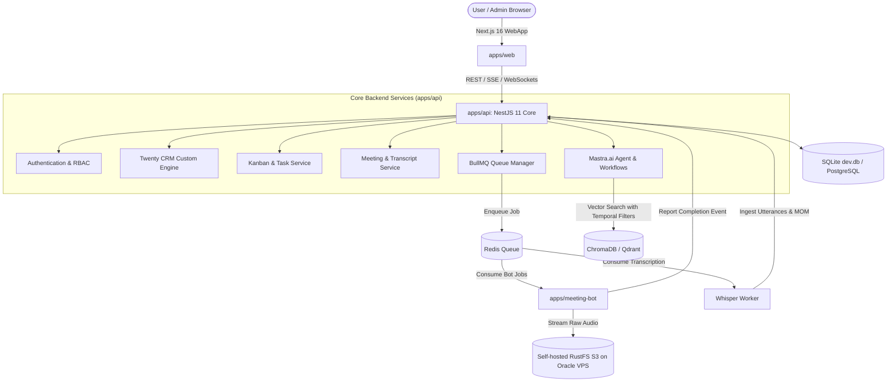

# 01. Architecture and System Overview

## 1. Executive Summary
Kara is an autonomous AI Chief of Staff and Workspace Operating System for teams. It bridges real-time meeting intelligence, automated task management, dynamic CRM modeling, and truthful RAG search.

Unlike the previous prototype (`meera` / `self-attendee`), Kara replaces fragile multi-repo microservices and synchronous Celery queues with an enterprise **Turborepo Monorepo** featuring an asynchronous **BullMQ pipeline**, **Next.js 16 App Router**, **NestJS 11 Core**, and **Mastra.ai**.

---

## 2. Monorepo Structure

```
kara/
+-- apps/
¦   +-- web/                     # Next.js 16 (React 19, Tailwind v4, TanStack Query/Table, Zustand)
¦   +-- api/                     # NestJS 11 Core + @mastra/nestjs + BullMQ Queues + S3
¦   +-- meeting-bot/             # Stateless containerized Chromium bot (Puppeteer/WebRTC)
+-- packages/
¦   +-- db/                      # Database Layer (Prisma / Drizzle ORM schemas)
¦   +-- shared-types/            # Shared Zod schemas, TypeScript DTOs, and enums
¦   +-- ui/                      # Shared design tokens & Radix UI primitives
+-- docs/                        # Numbered system architecture and feature documentation
+-- .env.example                 # Centralized single-environment configuration
+-- docker-compose.yml           # Optional containerized infra (PostgreSQL, Redis, Chroma/Qdrant)
+-- pnpm-workspace.yaml          # pnpm workspace package mappings
+-- turbo.json                   # Turborepo task pipeline and caching rules
```

---

## 3. High-Level System Architecture



---

## 4. Why This Architecture Eliminates Previous Bottlenecks

1. **Decoupled Bot Lifecycle**:
   The meeting bot never accesses the primary database directly. It records audio streams directly to S3 and reports lifecycle status through authenticated, idempotent webhooks.
2. **Batch Ingestion Instead of Per-Utterance Worker Storms**:
   Instead of launching a separate Celery task for every 3-second audio slice (which previously locked database rows), complete meetings or structured audio segments are ingested in single transactional batches.
3. **Single Shared Type System**:
   Any schema change in `@kara/shared-types` propagates instantly across frontend, backend, and agent tools at compile-time.

