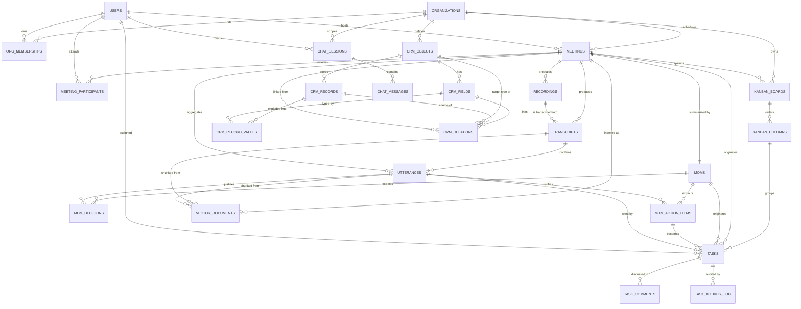

# 08. Database Schema Reference & Query Cookbook

> **Status**: Implements the Phase 2A design from doc 07. The schema lives in
> `packages/db` as Drizzle ORM table definitions. This document is the reference for
> every table, the conventions they follow, and the exact queries the application is
> expected to run against them.

---

## 1. Scope & Source of Truth

| Concern | Owner |
| :--- | :--- |
| Table definitions | `packages/db/src/schema/*.ts` |
| Domain enums | `packages/shared-types/src/enums.ts` |
| Connection + pragmas | `packages/db/src/client.ts` |
| Migrations | `packages/db/drizzle/` (generated by `drizzle-kit`) |
| This document | Narrative reference + query cookbook |

**Dev target**: SQLite via `better-sqlite3` at `file:./dev.db` (`.env.example`).
**Prod target**: PostgreSQL. The port path is in §7 — the schema is written to keep that
mechanical, but it is **not** dual-dialect today.

---

## 2. Conventions

### 2.1 Identifiers

Every primary key is an opaque `TEXT` with a type prefix, generated client-side by
`prefixedId()` in `packages/db/src/columns.ts`:

```
<prefix>_<24 hex chars>     e.g.  meet_9f2c4a1b8d3e5f60718293a4
```

Client-side generation (rather than `AUTOINCREMENT`) lets the API, the bot webhook
handlers, and seed scripts mint ids without a round-trip. This matters for the
recording pipeline, which reports state through idempotent webhooks (doc 03 §3) — a
retried webhook re-uses the same id instead of inserting a duplicate.

**Prefix registry** — keep this table in sync when adding a table:

| Prefix | Table | Prefix | Table |
| :--- | :--- | :--- | :--- |
| `org` | `organizations` | `brd` | `kanban_boards` |
| `usr` | `users` | `col` | `kanban_columns` |
| `mem` | `org_memberships` | `tsk` | `tasks` |
| `meet` | `meetings` | `cmt` | `task_comments` |
| `rec` | `recordings` | `log` | `task_activity_log` |
| `trn` | `transcripts` | `obj` | `crm_objects` |
| `utt` | `utterances` | `fld` | `crm_fields` |
| `par` | `meeting_participants` | `crec` | `crm_records` |
| `mom` | `moms` | `val` | `crm_record_values` |
| `dec` | `mom_decisions` | `rel` | `crm_relations` |
| `act` | `mom_action_items` | `cht` | `chat_sessions` |
| | | `msg` | `chat_messages` |
| | | `vec` | `vector_documents` |

> Docs 05/06 use short forms like `obj_deal` and `meet_12893` for readability. Those are
> abbreviated; real ids are always 24-hex.

### 2.2 Timestamps

All temporal columns are **unix milliseconds** as `INTEGER`
(`integer(name, { mode: "timestamp_ms" })`), surfaced to TypeScript as `Date`.

Chosen to match the vector metadata contract already documented in doc 04 §3
(`"meeting_timestamp": 1727184000000`). SQLite has no native date type, and integers
sort and range-scan correctly under a B-tree — which is exactly what the
`status = COMPLETED AND ended_at <= NOW()` guardrail depends on.

**Never store ISO-8601 strings.** They compare lexicographically by accident, which
works until a timezone offset appears in the string.

Durations are stored separately as plain `INTEGER` seconds (`duration_seconds`,
`attendance_seconds`) so they can be summed without arithmetic on timestamps.

### 2.3 Soft Deletes

User-facing entities carry a nullable `deleted_at`. Reads must filter it out:

```ts
import { isNull } from "drizzle-orm";
const live = await db.select().from(meetings).where(isNull(meetings.deletedAt));
```

Deliberately **not** soft-deleted: `utterances`, `task_activity_log`, `crm_relations`.
The first two are append-only evidence (a "deleted" utterance would break the citation
promise in doc 04), and relation rows are cheap to hard-delete.

### 2.4 Tenant Scoping

Every domain table carries `org_id`. This is not decoration: composite indexes lead with
`org_id`, and every API-layer query is expected to filter on it. A query that reads
domain data without an `org_id` predicate is a bug.

### 2.5 Enums

Enums are stored as their **string values**, never ordinals. The values live in
`@kara/shared-types` and are bound into each column with Drizzle's `.$type<Enum>()`, so
a value that is not a valid member fails at compile time.

`$type<Enum>()` is used rather than `{ enum: [...] }` deliberately. On SQLite the `enum`
config is a type-inference helper that emits **no DDL** — there is no `CREATE TYPE`, and
`drizzle-kit` writes a plain `TEXT` column either way. `$type` gives the same
compile-time safety while also accepting a TypeScript enum object directly, with no
per-column value array to keep in sync.

SQLite has no native `ENUM`, so nothing stops an out-of-band `UPDATE` from writing
garbage. The application layer and the TypeScript types are the enforcement point; §7
notes that PostgreSQL will add a real `CHECK` or `pgEnum`.

---

## 3. Entity-Relationship Diagram



---

## 4. Table Reference

### 4.1 Auth & Tenancy (`schema/auth.ts`)

| Table | Purpose | Key columns |
| :--- | :--- | :--- |
| `organizations` | Tenant root | `slug` (unique), `domain`, `plan`, `settings` JSON |
| `users` | Person identity, global | `email` (unique), `role`, `timezone`, `is_active`, `last_seen_at` |
| `org_memberships` | User ↔ Org with per-org role | `(org_id, user_id)` unique, `role`, `status`, `joined_at` |

Two roles exist and they are not the same thing: `users.role` is the platform-wide
default, while `org_memberships.role` is the authority inside one tenant. Authorization
checks must read the membership row for the org being accessed, never `users.role`.

The `(org_id, user_id)` unique index is what makes invite acceptance idempotent when a
webhook or email link is replayed.

### 4.2 Meeting Intelligence (`schema/meetings.ts`)

| Table | Purpose | Key columns |
| :--- | :--- | :--- |
| `meetings` | Calendar event / call | `status`, `meeting_type`, `scheduled_start_at`, `actual_end_at`, `host_user_id`, `bot_*` |
| `recordings` | Audio object in RustFS | `s3_bucket`, `s3_key`, `status`, `checksum`, `duration_seconds` |
| `transcripts` | Diarized document | `language`, `provider`, `status`, `word_count`, `raw_payload` JSON |
| `utterances` | One speaker turn | `start_ms`, `end_ms`, `text`, `sequence`, `type`, `is_sensitive` |
| `meeting_participants` | Attendance join | `role`, `display_name`, `joined_at`, `attendance_seconds`, `is_bot` |

`meetings` is the load-bearing table for the anti-hallucination guarantee. `status` and
`actual_end_at` are the columns the agent tools filter on, and
`meetings_org_status_end_idx` makes those filters a range scan.

`recordings.s3_key` has a unique index on `(s3_bucket, s3_key)` together with the
`checksum` column so a replayed upload webhook cannot double-insert.

`utterances.start_ms` / `end_ms` are offsets from the start of the recording. These are
what the UI converts into the `MM:SS` deep-link from doc 06 §2 ("replay the exact
seconds where the decision was made").

`utterances.speaker_user_id` is nullable because diarization produces labels
(`SPEAKER_00`), not identities. `speaker_name` retains what was heard even when the
label is never resolved to an account.

`meeting_participants` allows `user_id IS NULL` for external attendees. SQLite treats
NULLs as distinct in a UNIQUE index, so the `(meeting_id, user_id)` constraint does not
collapse multiple external guests into one row.

### 4.3 MOM — Minutes of Meeting (`schema/mom.ts`)

| Table | Purpose | Key columns |
| :--- | :--- | :--- |
| `moms` | One summary per meeting | `meeting_id` (unique), `status`, `summary`, `topics` JSON |
| `mom_decisions` | Extracted decisions | `statement`, `context_quote`, `source_utterance_id` |
| `mom_action_items` | Extracted action items | `title`, `assignee_user_id`, `due_date`, `priority`, `status` |

`moms.meeting_id` is **unique**: one MOM per meeting. That is what makes the BullMQ
`mom-synthesis` job idempotent under retries — a retried job hits the constraint rather
than producing a second summary.

`context_quote` on `mom_decisions` stores the verbatim transcript text supporting the
decision. It is the human-auditable proof that the summary is grounded, and the same
pattern the citation rule in doc 04 §3 enforces for chat.

**Link direction note**: the relationship between an action item and the task it became
is stored on the *task* side, as `tasks.source_action_item_id` — not as a
`converted_task_id` on the action item. Keeping one owner avoids a circular import
between `mom.ts` and `kanban.ts`, and means there is exactly one place to look.

### 4.4 Kanban & Task OS (`schema/kanban.ts`)

| Table | Purpose | Key columns |
| :--- | :--- | :--- |
| `kanban_boards` | Board container | `(org_id, slug)` unique, `meeting_id`, `is_default`, `position` |
| `kanban_columns` | Ordered column | `board_id`, `status`, `position`, `wip_limit` |
| `tasks` | Task card | `title`, `status`, `priority`, `position`, `assignee_user_id`, `due_date`, four `source_*` FKs |
| `task_comments` | Threaded comment | `author_user_id` (NULL = Kara), `parent_comment_id`, `body` |
| `task_activity_log` | Append-only audit | `action`, `field`, `from_value`, `to_value`, `actor_user_id` |

`position` is `REAL` on both columns and tasks. Fractional values let a card be dropped
*between* two neighbours without renumbering the column — the standard trick for
`@dnd-kit` drag-and-drop (doc 07 Phase 7), which would otherwise rewrite every row on
each drop.

`kanban_columns.status` maps each (possibly renamed) column back onto the canonical
`TaskStatus` enum. Without it, the Laya `TASK_LOOKUP` route would have to know each
user's column naming to answer "what's in progress?".

`tasks` carries four provenance FKs — `source_meeting_id`, `source_mom_id`,
`source_action_item_id`, `source_utterance_id` — all `ON DELETE SET NULL`. Together
they implement doc 06 §2: a card always knows where it came from, and the UI can offer
the audio deep-link. Note they are `SET NULL`, not `CASCADE`: deleting a meeting must
not silently delete the work it generated.

`task_activity_log` has no `updated_at` or `deleted_at` by design. Rows are never
mutated, which is what makes it usable as an undo source.

`task_comments.parent_comment_id` is intentionally a plain `TEXT` column with no FK
constraint — the self-reference would need a deferred constraint to allow inserting a
parent and child in one transaction, which SQLite cannot express portably.

### 4.5 Twenty CRM Custom Data Engine (`schema/crm.ts`)

| Table | Purpose | Key columns |
| :--- | :--- | :--- |
| `crm_objects` | Dynamic entity definition | `(org_id, slug)` unique, `singular_label`, `icon`, `is_system`, `position` |
| `crm_fields` | Column definition | `(object_id, name)` unique, `type`, `options` JSON, `relation_object_id`, `relation_kind` |
| `crm_records` | Data row | `object_id`, `title`, `data` JSON |
| `crm_record_values` | EAV store | `(record_id, field_id)` unique, `text_value`, `number_value`, `date_value`, `bool_value`, `json_value` |
| `crm_relations` | Relation link | `field_id`, `source_record_id`, `target_record_id` XOR `target_meeting_id` |

**Why both `crm_records.data` and `crm_record_values`?** This is the single most
important design decision in the CRM engine, so it is stated explicitly:

- `data` is a denormalized JSON snapshot. The Twenty-style table view (doc 05 §3)
  renders 50 rows from **one** SELECT with no joins and no pivoting.
- `crm_record_values` explodes the same values into one row per field, each in a
  correctly-typed column. That is what makes
  `stage == "Negotiation" AND value > 10000` answerable by an index rather than by
  scanning and JSON-parsing every row.

Both are written in the same transaction. `data` is the source of truth for *display*;
the EAV rows are the source of truth for *filtering*. A repair job must be able to
rebuild either from the other.

`crm_relations` targets are polymorphic per doc 05 §2B: a `RELATION` field may point at
another CRM record *or* at a meeting. Exactly one of `target_record_id` /
`target_meeting_id` is set. SQLite cannot express that XOR without a `CHECK` this
schema deliberately omits for portability, so the CRM service enforces it on write.

### 4.6 AI & Vector (`schema/ai.ts`)

| Table | Purpose | Key columns |
| :--- | :--- | :--- |
| `chat_sessions` | Conversation thread | `user_id`, `title`, `route`, `message_count`, `last_message_at` |
| `chat_messages` | One turn | `role`, `content`, `route`, `route_confidence`, `citations` JSON, `tool_calls` JSON, `latency_ms` |
| `vector_documents` | Vector provenance | `meeting_id`, `collection`, `external_vector_id`, `chunk_index`, `meeting_timestamp_ms`, `meeting_status`, `embedding_status` |

`vector_documents` is the relational mirror of doc 04 §3's metadata payload. ChromaDB
owns the vectors; this table owns the provenance. It exists for two reasons:

1. `meeting_status` and `meeting_timestamp_ms` are denormalized here so the indexer can
   rebuild the hard filter (`status = COMPLETED AND ts <= now`) without a join, and so a
   meeting flipping to `CANCELLED` can mark its chunks `STALE` in one statement.
2. It gives the UI a way to list what is indexed for a meeting and force a re-index —
   neither of which vector stores expose ergonomically.

`(meeting_id, chunk_index)` is unique, which makes re-indexing an upsert instead of a
duplicate-producing append.

`chat_messages.route` + `route_confidence` persist what Laya decided *before* the LLM
ran. That is what powers the query-route badge in doc 07 Phase 7 and lets router
accuracy be measured offline without re-running inference.

---

## 5. Query Cookbook

All snippets assume:

```ts
import { getDb } from "@kara/db";
import { and, desc, eq, gt, gte, isNull, lte, ne } from "drizzle-orm";
// §5.9 additionally needs `alias`, which comes from the dialect module:
import { alias } from "drizzle-orm/sqlite-core";
```

### 5.1 Non-hallucinatory past meetings (doc 04 §2A)

The `getPastMeetings` tool. Note `lte(actualEndAt, now)` is not optional.

```ts
const now = new Date();

const past = await db
  .select()
  .from(meetings)
  .where(
    and(
      eq(meetings.orgId, orgId),
      eq(meetings.status, MeetingStatus.COMPLETED),
      lte(meetings.actualEndAt, now),
      isNull(meetings.deletedAt),
    ),
  )
  .orderBy(desc(meetings.actualEndAt))
  .limit(5);
```

### 5.2 Upcoming schedule (doc 04 §2A)

Strictly disjoint from 5.1 — different status, different operator, different column.

```ts
const upcoming = await db
  .select()
  .from(meetings)
  .where(
    and(
      eq(meetings.orgId, orgId),
      eq(meetings.status, MeetingStatus.SCHEDULED),
      gte(meetings.scheduledStartAt, now),
      isNull(meetings.deletedAt),
    ),
  )
  .orderBy(meetings.scheduledStartAt)
  .limit(10);
```

> These two queries must never be merged behind an `includePast` flag. That is precisely
> the bug described in doc 04 §1 that caused the old system to fabricate discussions
> from future meetings.

### 5.3 Transcript viewer (doc 07 Phase 7)

Utterances for the audio-synced viewer, in playback order:

```ts
const turns = await db
  .select({
    id: utterances.id,
    speaker: utterances.speakerName,
    startMs: utterances.startMs,
    endMs: utterances.endMs,
    text: utterances.text,
    type: utterances.type,
  })
  .from(utterances)
  .where(eq(utterances.transcriptId, transcriptId))
  .orderBy(utterances.sequence);
```

Order by `sequence`, not `start_ms`. Diarization occasionally emits overlapping or
out-of-order timestamps; `sequence` is the authoritative reading order, and
`(transcript_id, sequence)` is unique so it is also the stable cursor for streaming.

### 5.4 Action items for a meeting, with their audio deep-link

```ts
const items = await db
  .select({
    title: momActionItems.title,
    priority: momActionItems.priority,
    status: momActionItems.status,
    dueDate: momActionItems.dueDate,
    // The MM:SS the UI seeks to (doc 06 §2).
    startMs: utterances.startMs,
    meetingTitle: meetings.title,
  })
  .from(momActionItems)
  .leftJoin(utterances, eq(momActionItems.sourceUtteranceId, utterances.id))
  .innerJoin(meetings, eq(momActionItems.meetingId, meetings.id))
  .where(eq(momActionItems.meetingId, meetingId))
  .orderBy(momActionItems.sequence);
```

### 5.5 Kanban board load (doc 07 Phase 7)

One query for the board, one for the cards, then group in memory. Avoid N+1 per column.

```ts
const columns = await db
  .select()
  .from(kanbanColumns)
  .where(eq(kanbanColumns.boardId, boardId))
  .orderBy(kanbanColumns.position);

const cards = await db
  .select()
  .from(tasks)
  .where(and(eq(tasks.boardId, boardId), isNull(tasks.deletedAt)))
  .orderBy(tasks.position);
```

### 5.6 `listTasks` agent tool (doc 06 §3)

Answering "what tasks are blocked or due today?":

```ts
const dueToday = await db
  .select()
  .from(tasks)
  .where(
    and(
      eq(tasks.orgId, orgId),
      lte(tasks.dueDate, endOfToday),
      ne(tasks.status, TaskStatus.DONE),
      isNull(tasks.deletedAt),
    ),
  )
  .orderBy(tasks.priority, tasks.dueDate);
```

Served by `tasks_assignee_due_idx` when scoped to an assignee, and by
`tasks_org_status_idx` when scoped to the org.

### 5.7 Fractional reorder on drag-and-drop

```ts
// Drop card C between A (pos 1000) and B (pos 2000). No other row is touched.
await db
  .update(tasks)
  .set({ columnId: targetColumnId, position: (1000 + 2000) / 2 })
  .where(eq(tasks.id, cardId));
```

Re-normalize the column only when the gap between neighbours drops below a threshold
(e.g. `1e-6`), which needs thousands of consecutive drops at the same spot.

### 5.8 CRM record write (dual representation, doc 05)

```ts
await db.transaction(async (tx) => {
  const [record] = await tx
    .insert(crmRecords)
    .values({
      orgId,
      objectId,
      title: "Enterprise License - Acme Corp",
      data: { value: 45000, stage: "Negotiation" },
      createdById: userId,
    })
    .returning();

  await tx.insert(crmRecordValues).values([
    { orgId, objectId, recordId: record.id, fieldId: valueFieldId, numberValue: 45000 },
    { orgId, objectId, recordId: record.id, fieldId: stageFieldId, textValue: "Negotiation" },
  ]);
});
```

The `(record_id, field_id)` unique index makes this upsertable with
`onConflictDoUpdate`, which is what the inline cell editor needs.

### 5.9 CRM compound filter (doc 05 §3)

`stage == "Negotiation" AND value > 10000`, answered from the EAV side:

```ts
const stageField = alias(crmRecordValues, "stage");
const valueField = alias(crmRecordValues, "value");

const rows = await db
  .select({ recordId: crmRecords.id, data: crmRecords.data })
  .from(crmRecords)
  .innerJoin(stageField, eq(stageField.recordId, crmRecords.id))
  .innerJoin(valueField, eq(valueField.recordId, crmRecords.id))
  .where(
    and(
      eq(crmRecords.objectId, objectId),
      eq(stageField.fieldId, stageFieldId),
      eq(stageField.textValue, "Negotiation"),
      eq(valueField.fieldId, valueFieldId),
      gt(valueField.numberValue, 10000),
      isNull(crmRecords.deletedAt),
    ),
  );
```

Note `alias` — a self-join needs distinct names, and the filter bar is a self-join per
condition.

### 5.10 Temporal vector guardrail (doc 04 §3)

Before querying the vector store, resolve which chunks are eligible:

```ts
const eligible = await db
  .select({ vectorId: vectorDocuments.externalVectorId })
  .from(vectorDocuments)
  .where(
    and(
      eq(vectorDocuments.meetingStatus, MeetingStatus.COMPLETED),
      lte(vectorDocuments.meetingTimestampMs, Date.now()),
      eq(vectorDocuments.embeddingStatus, EmbeddingStatus.INDEXED),
    ),
  );
```

The vector store filter is then applied to that id set, so the guardrail holds even if
the collection metadata drifts.

### 5.11 Idempotent bot webhook (doc 03 §3)

The bot makes no SQL calls; this runs in the API when it receives an event.

```ts
// Replays are absorbed: same bucket+key means the same recording.
await db
  .insert(recordings)
  .values({ orgId, meetingId, s3Bucket, s3Key, checksum, status: RecordingStatus.UPLOADED })
  .onConflictDoUpdate({
    target: [recordings.s3Bucket, recordings.s3Key],
    set: { status: RecordingStatus.UPLOADED, uploadedAt: new Date() },
  });
```

### 5.12 Batch transcript ingest (doc 03 §2)

The whole point of the batch design: one transaction, no per-utterance worker storm.

```ts
await db.transaction(async (tx) => {
  const [transcript] = await tx
    .insert(transcripts)
    .values({ orgId, meetingId, recordingId, status: TranscriptStatus.PROCESSING })
    .returning();

  await tx.insert(utterances).values(
    turns.map((t, i) => ({
      orgId,
      meetingId,
      transcriptId: transcript.id,
      speakerLabel: t.speaker,
      startMs: t.startMs,
      endMs: t.endMs,
      text: t.text,
      sequence: i,
    })),
  );

  await tx
    .update(transcripts)
    .set({ status: TranscriptStatus.COMPLETED, utteranceCount: turns.length })
    .where(eq(transcripts.id, transcript.id));
});
```

SQLite caps a statement at 999 bound parameters. With 12 columns per utterance that is
~83 rows per `INSERT`; the ingest helper must chunk larger meetings into batches inside
the same transaction.

### 5.13 Chat history with citations

```ts
const [session] = await db.select().from(chatSessions).where(eq(chatSessions.id, sessionId));

const history = await db
  .select()
  .from(chatMessages)
  .where(eq(chatMessages.sessionId, sessionId))
  .orderBy(chatMessages.createdAt);
```

`citations` arrives already typed as `ChatCitation[]`, so the UI can render pills and
deep-link straight to a meeting timestamp without parsing.

---

## 6. Index Strategy

Every index below exists for a named query. Indexes are not free — each one costs write
amplification, which matters because the transcript pipeline inserts in bulk.

| Index | Table | Serves |
| :--- | :--- | :--- |
| `meetings_org_status_end_idx` (`org_id`,`status`,`actual_end_at`) | `meetings` | §5.1 past-meeting guardrail |
| `meetings_org_scheduled_start_idx` (`org_id`,`scheduled_start_at`) | `meetings` | §5.2 upcoming schedule |
| `meetings_meeting_type_idx` (`org_id`,`meeting_type`) | `meetings` | Laya meeting-type filters |
| `meetings_host_user_idx` | `meetings` | "my meetings" |
| `recordings_s3_key_unique` (`s3_bucket`,`s3_key`) | `recordings` | §5.11 webhook idempotency |
| `utterances_transcript_sequence_unique` | `utterances` | §5.3 ordered read + stream cursor |
| `utterances_meeting_start_idx` (`meeting_id`,`start_ms`) | `utterances` | timestamp deep-link seek |
| `mom_decisions_mom_idx` / `mom_action_items_mom_idx` | MOM | §5.4 MOM tabs |
| `mom_action_items_assignee_idx` (`assignee_user_id`,`status`) | `mom_action_items` | "my action items" |
| `tasks_board_column_position_idx` | `tasks` | §5.5 board load |
| `tasks_assignee_due_idx` (`assignee_user_id`,`due_date`) | `tasks` | §5.6 `listTasks` |
| `tasks_org_status_idx` (`org_id`,`status`) | `tasks` | board-wide status rollups |
| `tasks_org_priority_idx` (`org_id`,`priority`,`status`) | `tasks` | "blocked / urgent" filters |
| `crm_fields_object_name_unique` | `crm_fields` | field lookup by machine key |
| `crm_record_values_record_field_unique` | `crm_record_values` | §5.8 upsert target |
| `crm_record_values_field_text_idx` / `_field_number_idx` / `_field_date_idx` | `crm_record_values` | §5.9 typed filters |
| `vector_documents_meeting_chunk_unique` | `vector_documents` | re-index without duplicates |
| `vector_documents_meeting_status_ts_idx` | `vector_documents` | §5.10 temporal guardrail |
| `chat_messages_session_created_idx` | `chat_messages` | §5.13 history paging |

**Deliberately omitted**: no index on `meetings.title`, `crm_records.data`, or
`utterances.text`. Free-text search over transcripts belongs in the vector store and,
for CRM names, in a future FTS5 virtual table — not in a B-tree that would bloat every
insert in the hot ingestion path.

**Every composite index leads with `org_id`** (or with the FK that implies it). This is
what lets the planner satisfy both the tenant predicate and the sort from one index.

---

## 7. SQLite → PostgreSQL Migration Path

The schema is written for SQLite, because that is the configured dev default
(`.env.example`, Phase 1). `DATABASE_PROVIDER=postgresql` is already in the env contract,
so here is exactly what changes.

Drizzle cannot express one schema for both dialects — `sqliteTable` and `pgTable` are
different builders with different column constructors. The port is therefore a second
set of files, not a config flag. What this schema does to keep that mechanical:

| Concern | SQLite today | PostgreSQL target | Port difficulty |
| :--- | :--- | :--- | :--- |
| Table builder | `sqliteTable` | `pgTable` | Mechanical rename |
| Timestamps | `integer({mode:"timestamp_ms"})` | `timestamptz` | Mechanical; keep ms semantics |
| Booleans | `integer({mode:"boolean"})` → 0/1 | `boolean` | Mechanical |
| JSON | `text({mode:"json"})` | `jsonb` | Mechanical, and a **win**: filterable |
| Enums | `text().$type<Enum>()` | `pgEnum` or `text` + `CHECK` | Adds real DB-level enforcement |
| IDs | `text` PK | `text` PK (unchanged) | None — ids are already client-generated |
| Decimal money | `real` | `numeric` | **Requires a decision**; `real` is lossy |
| `REAL` positions | `real` | `double precision` | None |
| Cascades | `PRAGMA foreign_keys=ON` | native | None |

Known SQLite limitations that the schema routes around, and which the port removes:

1. **No `ALTER COLUMN`.** Migrations must be table-rebuilds. `drizzle-kit generate`
   handles this, but it rewrites the table — plan migrations during low traffic.
2. **Single writer.** Mitigated by WAL + `busy_timeout` in `client.ts`, but concurrent
   writes still serialize. PostgreSQL removes this wall, and is the main reason to port
   once more than a couple of BullMQ workers ingest at once.
3. **999 bound parameters per statement.** Drives the chunking in §5.12. PostgreSQL's
   limit is 65535, so the chunking becomes unnecessary (harmless if kept).
4. **No native `ENUM` / partial `CHECK` ergonomics.** Enum validity is application-only
   today; PostgreSQL should add `CHECK` constraints or `pgEnum` to make it structural.
5. **`real` is 4-byte float.** Fine for board `position`; **not** fine for currency.
   Any CRM `NUMBER` field used for money must become `numeric` on port.

**Concrete port order** (each step independently verifiable):

1. Add `packages/db/src/schema-pg/` mirroring the six modules.
2. Add a `pg.ts` client alongside `client.ts`, switched in `getDb()` on
   `DATABASE_PROVIDER`.
3. Stand up PostgreSQL in `docker-compose.yml` (already scaffolded).
4. Run `drizzle-kit generate` against the pg schema; diff the emitted DDL against the
   SQLite DDL by hand — this is the real verification step.
5. Migrate data with a script that reads from SQLite and writes to PostgreSQL; ids are
   already portable text, so no key remapping is needed.
6. Cut over once the RAG indexer has been re-run against PostgreSQL.

---

## 8. Invariants & Gotchas

1. **One MOM per meeting** (`moms.meeting_id` unique) — the synthesis job is idempotent
   by constraint, not by convention.
2. **`utterances` ordering is by `sequence`, never `start_ms`.**
3. **Deleting a meeting must not delete its tasks.** All four `tasks.source_*` FKs are
   `ON DELETE SET NULL` for this reason.
4. **`crm_records.data` and `crm_record_values` must be written together.** They are a
   dual representation of one fact; a repair job should reconcile them.
5. **`crm_relations` needs exactly one of `target_record_id` / `target_meeting_id`.**
   Application-enforced (§4.5).
6. **`vector_documents.meeting_status` is denormalized and can go stale.** When a
   meeting's status changes, chunks must be re-marked, or the guardrail in §5.10 will
   admit chunks from a meeting that is no longer completed.
7. **`org_id` is required on every domain read.** No exceptions.
8. **Soft-deleted rows are invisible unless explicitly unfiltered.** Every list query
   needs `isNull(...deletedAt)`.
9. **`updated_at` only auto-refreshes on Drizzle `update()` calls.** Raw SQL writes must
   set it explicitly.
10. **`utterances.is_sensitive` rows are excluded from RAG indexing** (doc 07 §2D content
    guard). The indexer must check this flag, not just the meeting status.

---

## 9. References

| Topic | Document |
| :--- | :--- |
| Monorepo layout, `packages/db` placement | [01. Architecture & System Overview](./01_ARCHITECTURE_AND_SYSTEM_OVERVIEW.md) |
| Ultralight local stack, SQLite/Chroma/RustFS setup | [02. Ultralight Local Stack Setup](./02_ULTRALIGHT_LOCAL_STACK_SETUP.md) |
| Bot lifecycle, batch ingest, `database is locked` fix | [03. Meeting Bot & Transcription Pipeline](./03_MEETING_BOT_AND_TRANSCRIPTION_PIPELINE.md) |
| Temporal guardrails, citation enforcement, vector metadata | [04. Non-Hallucinatory Mastra RAG](./04_NON_HALLUCINATORY_MASTRA_RAG.md) |
| Dynamic objects/fields, dual record representation | [05. Twenty CRM Custom Data Engine](./05_TWENTY_CRM_CUSTOM_DATA_ENGINE.md) |
| Task provenance, audio deep-links | [06. Notion Kanban & Task Management](./06_NOTION_KANBAN_TASK_MANAGEMENT.md) |
| Phase 2A design source, Phases 3–8 | [07. Phased Implementation Roadmap](./07_PHASED_IMPLEMENTATION_ROADMAP.md) |

### Code map

```
packages/db/
+-- drizzle.config.ts          # drizzle-kit entry
+-- src/
    +-- columns.ts             # primaryId / createdAt / updatedAt / deletedAt / bool / orgId
    +-- client.ts              # createDb / getDb / closeDb + pragmas
    +-- index.ts               # package entrypoint
    +-- schema/
        +-- index.ts           # barrel (all 24 tables)
        +-- auth.ts            # organizations, users, org_memberships
        +-- meetings.ts        # meetings, recordings, transcripts, utterances, meeting_participants
        +-- mom.ts             # moms, mom_decisions, mom_action_items
        +-- kanban.ts          # kanban_boards, kanban_columns, tasks, task_comments, task_activity_log
        +-- crm.ts             # crm_objects, crm_fields, crm_records, crm_record_values, crm_relations
        +-- ai.ts              # chat_sessions, chat_messages, vector_documents
```

### Common commands

```bash
# from packages/db
pnpm db:generate     # diff schema -> SQL migration in ./drizzle
pnpm db:migrate      # apply pending migrations
pnpm db:push         # dev-only: push schema directly, no migration files
pnpm db:studio       # browse data

# from repo root
pnpm build           # turbo build, includes @kara/db
```

---

## 10. Open Items (deferred to Phase 3)

- [ ] Seed script: 2 orgs × 5 users, 10 meetings, transcripts, 3 CRM objects, 1 board.
- [ ] Typed query helpers exported from `@kara/db` (§5 snippets, packaged).
- [ ] First generated migration committed under `packages/db/drizzle/`.
- [ ] FTS5 virtual table for CRM record title search.
- [ ] Decision on `numeric` vs `real` for currency fields before the PostgreSQL port.
